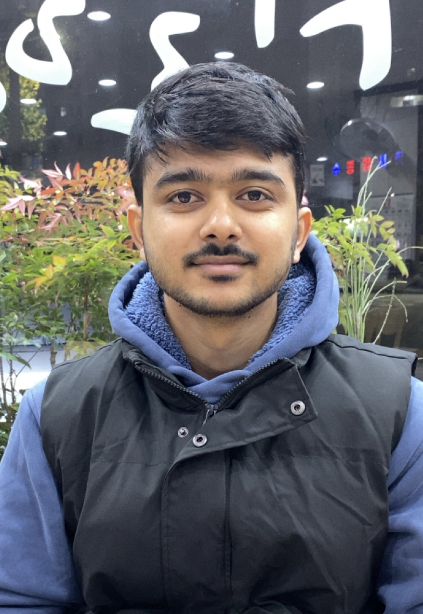

# 👋 Hi, I'm Rohan Phuyal

### Integrated Business Management Student

🇳🇵 Nepali Student | 🇰🇷 Currently Studying in South Korea

---

# 🙋 About Me

I am an Integrated Business Management student from Nepal currently studying in South Korea. I am passionate about business, international trade, and management. I enjoy working in diverse teams and developing practical solutions to business challenges.

My goal is to build a successful career in business management by applying my communication, teamwork, and analytical skills in a professional environment.

---

# 🎓 Education

**Bachelor's Degree in Integrated Business Management**

- Currently studying in South Korea
- Focused on Business Management, Management Science, and International Trade

---

# 💼 Skills

### Professional Skills
- Teamwork
- Communication
- Leadership
- Problem Solving
- Critical Thinking
- Time Management

### Technical Skills
- Microsoft Word
- Microsoft Excel
- Microsoft PowerPoint
- Business Reporting
- Data Analysis

---

# 🗣️ Languages

| Language | Level |
|-----------|---------|
| Nepali | Native |
| English | IELTS Overall Band 6.0 |
| Hindi | Fluent |
| Korean | Conversational |

---

# 📂 Projects

## 📊 Management Science Project

### Project Description
Applied management science techniques to analyze business problems and improve decision-making processes.
---

## 🌏 International Trade Project

### Project Description
Conducted research on international trade theories, global markets, and trade relationships between countries.

---

# 🏆 Certification

### IELTS Academic
- Overall Band Score: 6.0

---

# 🎯 Career Objective

To obtain opportunities where I can apply my business knowledge, communication abilities, and teamwork skills while continuing to develop professionally in an international environment.

---

# 📫 Contact

📧 Email: rohanphuyal32@gmail.com

---

### Thank You For Visiting My Portfolio!

⭐ Feel free to explore my projects and connect with me.

